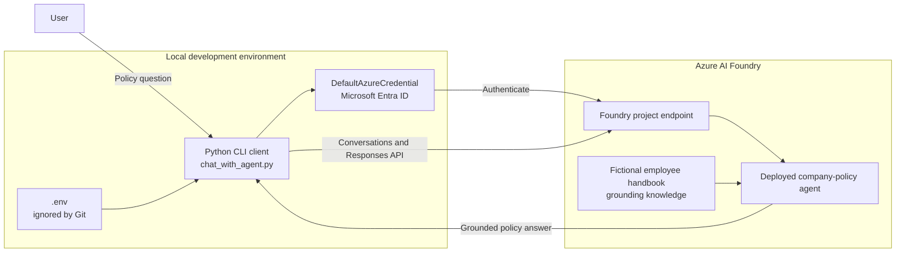

# Company Policy Assistant

A Microsoft Foundry (Azure AI Foundry) practice project: a command-line chat client that talks to an
Azure AI Foundry agent grounded on a fictional employee handbook, so answers can be verified against
known facts instead of general knowledge.

## System architecture



The Python client loads only the project endpoint and agent name from a local `.env` file, then uses
`DefaultAzureCredential` for passwordless Azure authentication. The deployed Foundry agent should be
configured with the fictional handbook in `docs/` as its grounding knowledge, so it can answer policy
questions from that source and acknowledge when the handbook does not contain the answer.

## Layout

```
docs/                                    Source knowledge document (the fictional handbook)
eval/                                    Manual test log and an automated eval dataset (query/ground_truth pairs)
foundry-policy-python/
├── chat_with_agent.py                   CLI chat loop against the deployed Foundry agent
├── requirements.txt                     Python dependencies
├── .env.example                         Required environment variables (copy to .env and fill in)
└── .env                                 Local secrets — gitignored, not committed
```

## Setup

1. Create and activate a virtual environment inside `foundry-policy-python/`:
   ```
   python -m venv .venv
   .venv\Scripts\activate
   ```
2. Install dependencies:
   ```
   pip install -r requirements.txt
   ```
3. Copy `.env.example` to `.env` and fill in the values:
   - `PROJECT_ENDPOINT` — your Azure AI Foundry project endpoint
   - `AGENT_NAME` — the name of the deployed agent (e.g. `company-policy-assistant`)
4. Authenticate with Azure (the script uses `DefaultAzureCredential`):
   ```
   az login
   ```

## Run

```
python foundry-policy-python/chat_with_agent.py
```

Type a question, or `exit` to quit.

## Evaluation

`eval/foundry_policy_eval_v1.jsonl` holds query/ground-truth pairs derived from `docs/FoundryLab_Practice_Company_Policy.txt`,
including questions the handbook does not answer (to check the agent correctly says so). `eval/FoundryLab_Test_Results.txt`
is a manual pass/fail run against those same questions.
